# Lab 6 AREP

Para clonar el proyecto 

Para el Backend:

git clone  ´ https://github.com/lalaro/LAB6AREP.git ´

Para el frontend:

git clone  ´ https://github.com/lalaro/LoginFrontend.git ´

### Prerrequisitos

Se necesita de Maven (La versión más reciente) y Java 21, la instalación debe realizarse desde las paginas oficiales de cada programa.

### Instalación

Para Maven debe irse a https://maven.apache.org/download.cgi, descargar la versión más nueva que allá de Maven (En este caso tenemos la versión 3.9.6) y agregarse en la carpeta de Program Files, luego se hace la respectiva configuración de variables de entorno según la ubicación que tenemos para el archivo de instalación, tanto de MAVEN_HOME y de Path.
Luego revisamos que haya quedado bien configurado con el comando para Windows:

` mvn - v `
o
` mvn -version `

Para Java debe irse a https://www.oracle.com/java/technologies/downloads/?er=221886, descargar la versión 21 de Java y agregarse en la carpeta de Program Files, luego se hace la respectiva configuración de variables de entorno según la ubicación que tenemos para el archivo de instalación, tanto de JAVA_HOME y de Path.
Luego revisamos que haya quedado bien configurado con el comando para Windows:

` java -version `

Si no tenemos la versión solicitada podemos hacer lo siguiente, para el caso de Windows:

Ir al Windows PowerShell y ejecutar como administrador los siguientes codigos:

` [System.Environment]::SetEnvironmentVariable("JAVA_HOME", "C:\Program Files\Java\jdk-21", [System.EnvironmentVariableTarget]::Machine) `

Revisar las rutas de la máquina

`  $env:JAVA_HOME = "C:\Program Files\Java\jdk-21" `

`  $env:Path = "C:\Program Files\Java\jdk-21\bin;" + $env:Path `

`  echo $env:JAVA_HOME `

`  javac -version `

`  java -version `

## Solución del lab

En este taller, diseñaremos e implementaremos una aplicación segura y escalable utilizando la infraestructura de AWS, centrándonos en las mejores prácticas de seguridad. Nuestra arquitectura constará de dos componentes principales:

Servidor 1: Servidor Apache
El servidor Apache será responsable de servir a un cliente HTML+JavaScript asíncrono a través de una conexión segura mediante TLS. El código del lado del cliente se entregará a través de canales cifrados, lo que garantiza la integridad y confidencialidad de los datos durante la descarga.
Servidor 2: Spring Framework
El servidor Spring gestionará los servicios de backend, ofreciendo endpoints API RESTful. Estos servicios también estarán protegidos mediante TLS, lo que garantiza una comunicación segura entre el cliente y el backend.
Características de Seguridad Clave:

Cifrado TLS: Transmisión segura de datos mediante certificados TLS generados mediante Let's Encrypt, lo que garantiza la confidencialidad e integridad.
Cliente Asíncrono: Nuestro cliente HTML+JavaScript utilizará técnicas asíncronas para optimizar el rendimiento y mantener una comunicación segura. Seguridad de inicio de sesión: Implementaremos la autenticación de inicio de sesión, con contraseñas almacenadas de forma segura como hashes.
Implementación en AWS: Todos los servicios se implementarán y gestionarán en AWS, aprovechando su infraestructura segura y confiable.
Este taller guiará a los participantes en el proceso de integración de estas medidas de seguridad, la configuración de implementaciones multiservidor y el uso de técnicas modernas de cifrado para proteger los datos de los usuarios.

### *Resumen del proyecto:*

Yo diseñé e implementé una aplicación segura y escalable en AWS, enfocándome en las mejores prácticas de seguridad. Configuré un servidor Apache para servir un cliente HTML+JavaScript asíncrono a través de una conexión segura con TLS, asegurando la integridad y confidencialidad de los datos. Además, desarrollé un backend con Spring Framework que ofrece endpoints API RESTful protegidos con TLS para garantizar una comunicación segura. Implementé cifrado TLS con certificados de Let's Encrypt, un cliente asíncrono para mejorar el rendimiento, y un sistema de autenticación con almacenamiento seguro de contraseñas en forma de hashes. Finalmente, desplegué todos los servicios en AWS, aprovechando su infraestructura confiable para garantizar la seguridad y escalabilidad del sistema.

### *Arquitectura del sistema:*

### *Detalle de la arquitectura:*

### *Descripción de la relación entre Apache, Spring y el cliente HTML+JS:*

La relación entre Apache, Spring y el cliente HTML+JavaScript sigue un modelo cliente-servidor con una capa de seguridad basada en TLS.

a. Apache como servidor web: Apache se encarga de servir los archivos estáticos del cliente, es decir, el código HTML, CSS y JavaScript. Además, establece una conexión segura mediante TLS, asegurando que la comunicación entre el usuario y el cliente web sea cifrada y protegida.

b. Cliente HTML+JavaScript: El cliente, ejecutado en el navegador, interactúa con el servidor backend mediante peticiones asíncronas (AJAX o Fetch API). Se comunica con los endpoints RESTful expuestos por Spring para obtener o enviar datos.

c. Spring como backend: Spring Framework maneja la lógica del servidor, procesando las solicitudes del cliente y respondiendo con datos en formato JSON. Además, protege las conexiones con TLS y gestiona la autenticación de usuarios mediante almacenamiento seguro de credenciales.

En conjunto, Apache distribuye la interfaz del cliente, que se conecta asíncronamente con Spring, garantizando una arquitectura modular, segura y escalable.

### *Implementación segura en AWS:*

Para garantizar una implementación segura en AWS, desplegué los servicios siguiendo las mejores prácticas de seguridad. Configuré Apache en una instancia EC2 para servir los archivos HTML+JavaScript de forma segura, utilizando certificados TLS de Let's Encrypt para cifrar la comunicación. El backend con Spring Framework se ejecuta en otra instancia EC2, asegurando un entorno aislado dentro de una VPC (Virtual Private Cloud) protegida.

### *Uso de TLS para conexiones seguras entre el cliente, Apache y Spring:*

Para garantizar conexiones seguras entre el cliente, Apache y Spring, implementé TLS (Transport Layer Security) en toda la comunicación. Configuré Apache con un certificado TLS de Let's Encrypt, permitiendo que el cliente HTML+JavaScript se conecte mediante HTTPS, asegurando la integridad y confidencialidad de los datos y protegiéndolos contra ataques como man-in-the-middle (MITM). Además, Apache actúa como proxy inverso, reenviando las solicitudes del cliente al backend en Spring a través de una conexión segura con TLS habilitado, evitando que datos sensibles sean interceptados. Gracias a esta implementación, toda la comunicación entre el cliente y el backend viaja cifrada y autenticada, asegurando una infraestructura segura y confiable.

### *Funcionalidad de inicio de sesión con contraseñas almacenadas de forma segura:*

Implementé un inicio de sesión seguro donde las contraseñas se almacenan de forma protegida con bcrypt, evitando el almacenamiento en texto plano. Al autenticarse, el sistema compara los hashes en lugar de las contraseñas originales, asegurando una mayor protección contra accesos no autorizados.

### *Capturas de pantalla:*

Se debe configurar la ruta donde está Apache

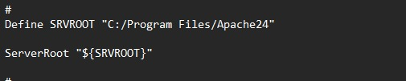

Y configuración del puerto donde va escuchar el front

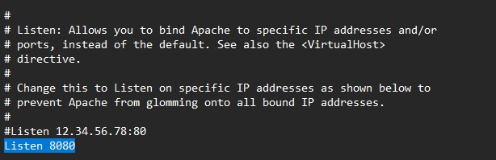

Es importante primero inciar Apache:

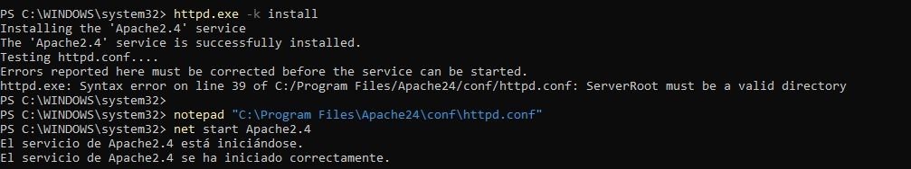
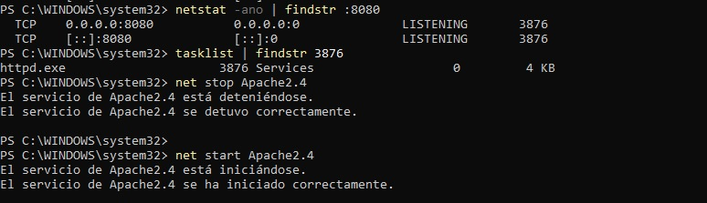

Comprobamos que Apache funcione:

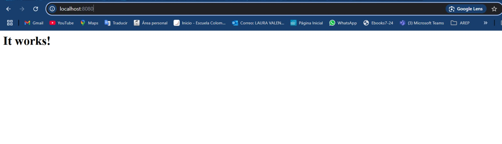

Se le da la ruta de nuestro proyecto Apache:

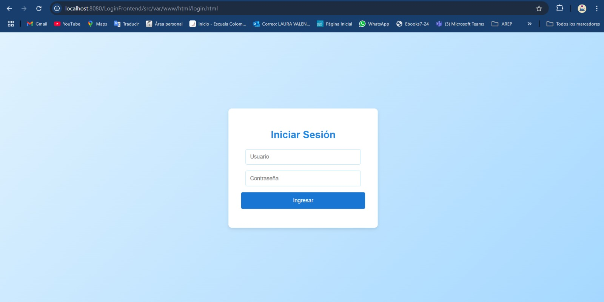
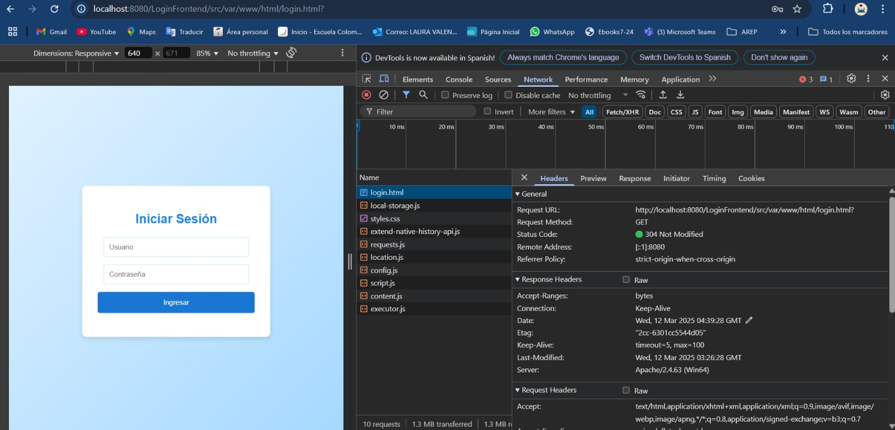

Se debe conectar el front con el back

Compilamos el proyecto back

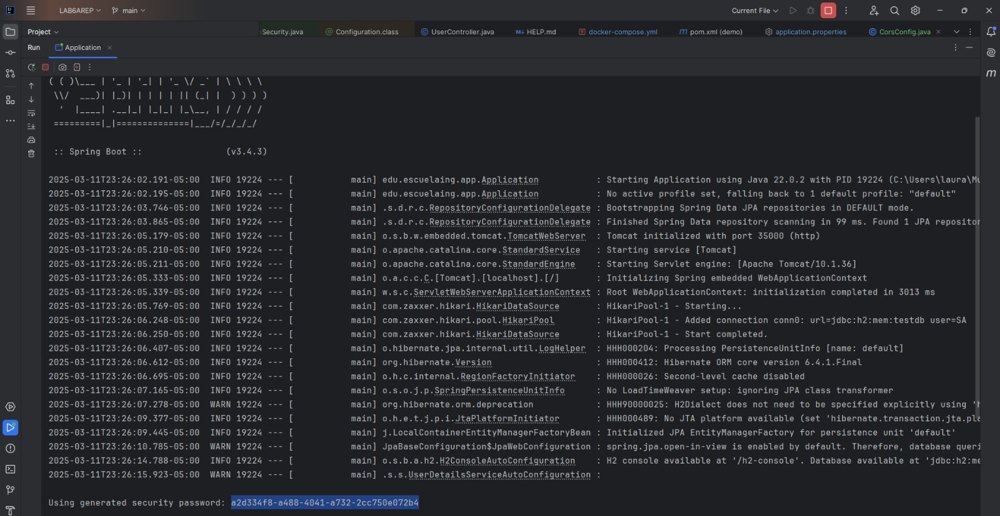

Se dockeriza el back con el front 

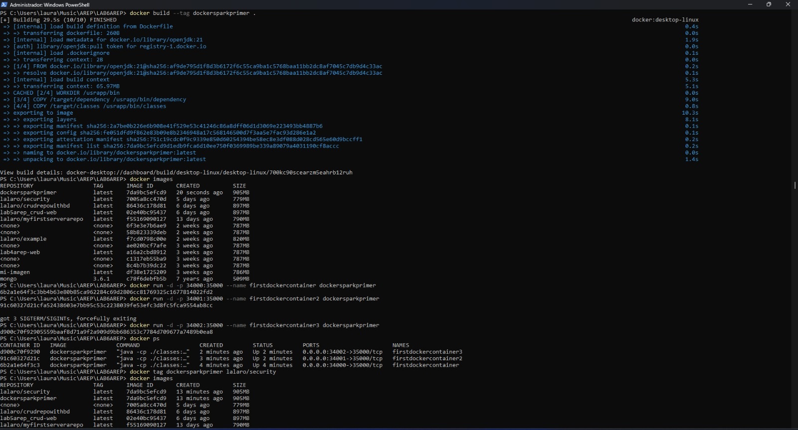
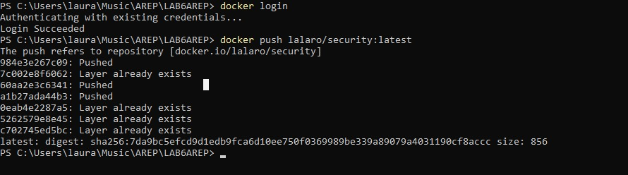

Configuramos los puertos del docker

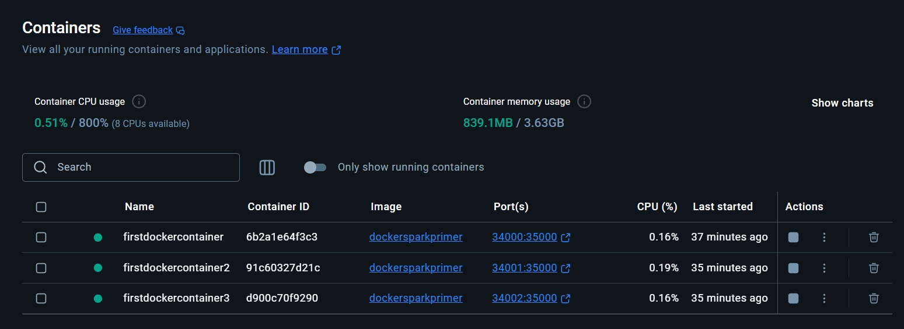

Se verifica el push del Docker

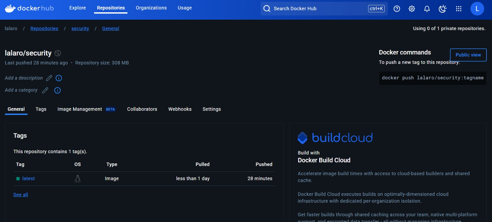
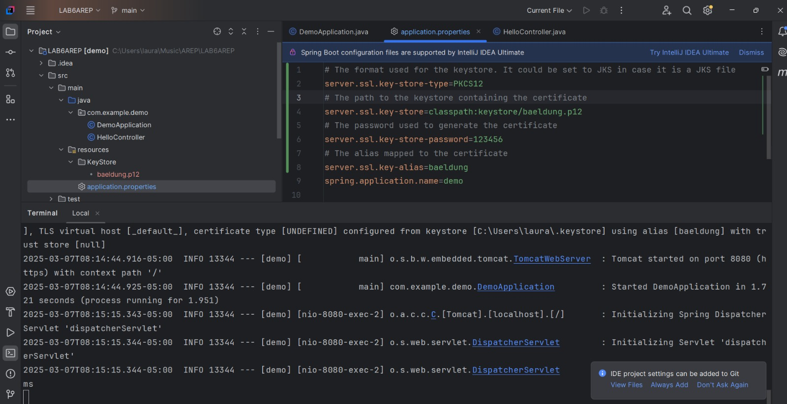

Se verifica que la ruta del Docker funcione:

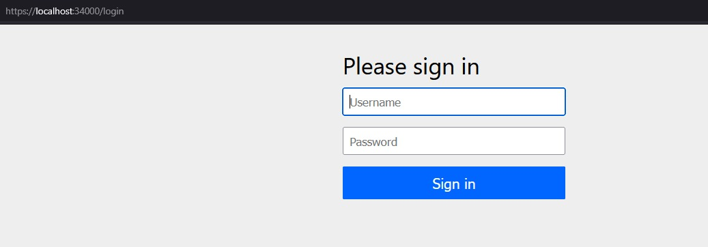

Es importante generar el certificado TLS para el front

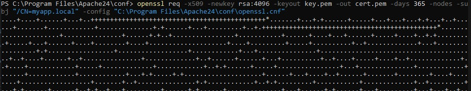

Se inician las instancias del EC2 y se configuran:

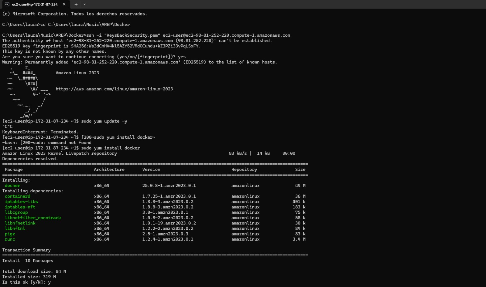
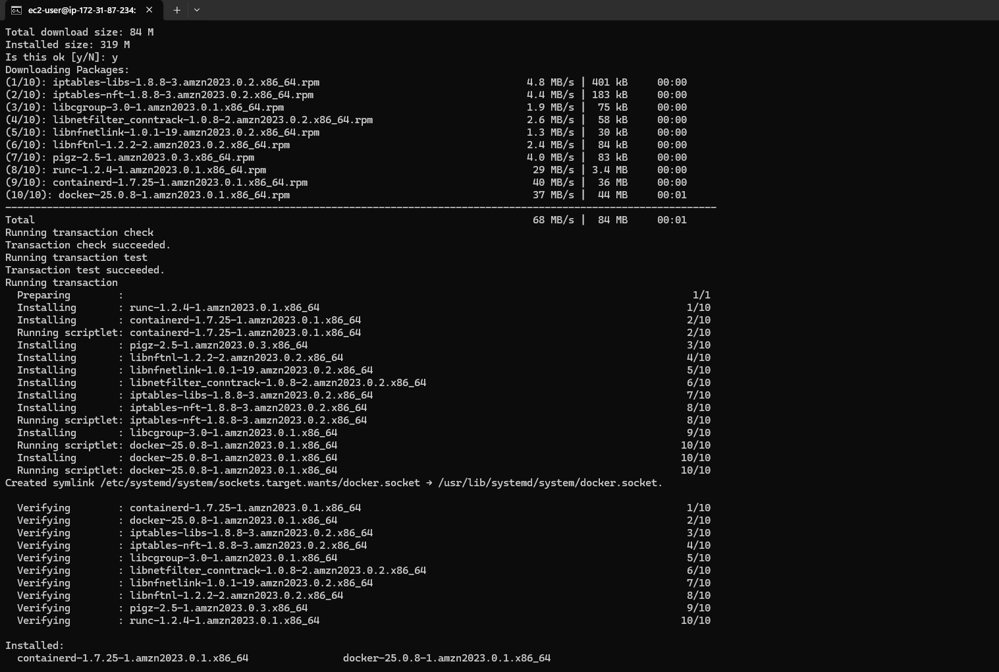
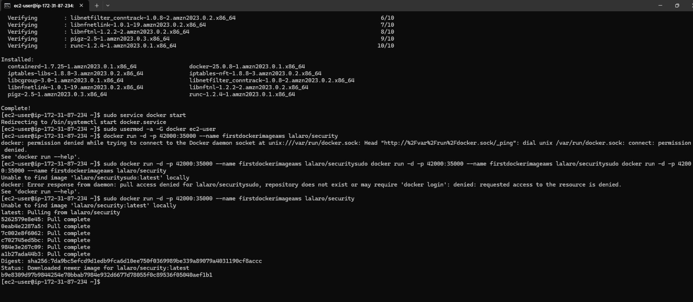
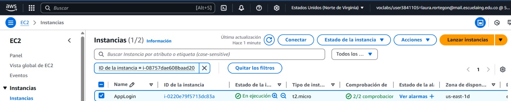

Tendremos nuestro despliegue con la seguridad, según el certificado TLS

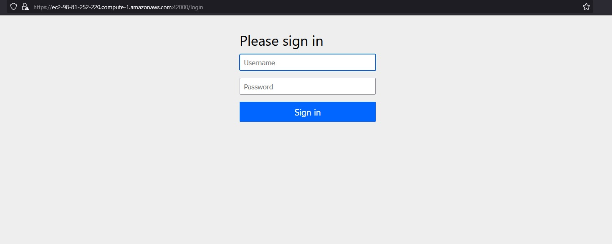

### *Video:*

Video: [Video funcionamiento](https://youtu.be/99LdZeAXAZ0)

## Ejecutando las pruebas

Podemos Abrir en terminal el proyecto y ejecutar las pruebas desde el PowerShell, en el caso de Windows. Y ejecutamos el comando:

` mvn test `

O de igual forma en el ID que deseemos.

Así se vera:

### Desglose en pruebas de extremo a extremo

### Y pruebas de estilo de código

## Despliegue

Podemos Abrir en terminal el proyecto y compilar y empaquetar el proyecto desde el PowerShell, en el caso de Windows. Y ejecutamos los comandos:

` mvn clean install `

` mvn spring-boot:run `

O de igual forma en el ID que deseemos.

Cabe recalcalcar que se pueden generar Advertencias, porque ya no está conectada la base de datos.

## Construido con

* [Maven](https://maven.apache.org/) - Gestión de dependencias.
* [Java](https://www.java.com/es/) - Versionamiento en Java.
* [GitHub](https://docs.github.com/es) - Sistema de control de versiones distribuido.
* [IntelliJ](https://www.jetbrains.com/es-es/idea/) - Entorno de desarrollo integrado.
* [AWS](https://docs.aws.amazon.com/es_es/) - Amazon Web Services / plataforma de servicios de nube.
* [Docker](https://docs.docker.com/) - Tecnología en contenedores que permite crear y usar contenedores Linux.
* [Spring Boot](https://docs.spring.io/spring-boot/index.html) -Herramienta de código abierto para desarrollar aplicaciones web y microservicios en Java

## Contribuyendo

Por favor, lee [CONTRIBUTING.md](https://gist.github.com/PurpleBooth/b24679402957c63ec426) para detalles sobre nuestro código de conducta y el proceso para enviarnos solicitudes de cambios (*pull requests*).

## Versionado

Usamos [SemVer](http://semver.org/) para el versionado.

## Autores

* **Laura Valentina Rodríguez Ortegón** - *Lab5 AREP* - [Repositorio](https://github.com/lalaro/LAB5AREP_CRUD.git)

## Licencia

Este proyecto está licenciado bajo la Licencia MIT - consulta el archivo [LICENSE.md](LICENSE.md) para más detalles.

## Reconocimientos

* Agradecimientos a la Escuela Colombiana de Ingeniería
* La documentación de Git Hub
* Al profesor Luis Daniel Benavides
